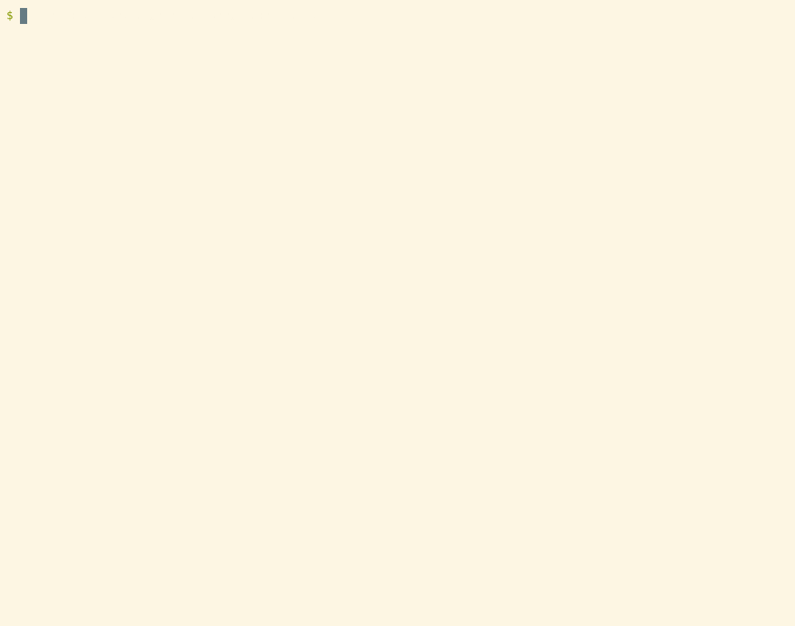

# Introduction

These are notes and links from the slides I will present.  I put these
together so you don't have to write information from the slides.  We
also have specific commands to type and links to other information
here.

<!-- markdown-toc start - Don't edit this section. Run M-x markdown-toc-refresh-toc -->
**Table of Contents**

- [Introduction](#introduction)
- [Slide 1.1 Workshop on Python Bytecode](#slide-11-workshop-on-python-bytecode)
- [Slide 3.2 Why Study Python Bytecode?](#slide-32-why-study-python-bytecode)
- [6.1 Getting Set up for the workshop.](#61-getting-set-up-for-the-workshop)
- [6.2 Python Installation via OS Package Install](#62-python-installation-via-os-package-install)
  - [GNU/Linux](#gnulinux)
  - [MacOS](#macos)
  - [MS Windows](#ms-windows)
- [6.3 Python Installation via Virtual Environment](#63-python-installation-via-virtual-environment)
  - [virtualenv](#virtualenv)
  - [pyenv](#pyenv)
  - [pyenv-win](#pyenv-win)
- [6.4 Software we will be using today](#64-software-we-will-be-using-today)
- [6.5 Optional programs](#65-optional-programs)
- [7.1 Python Bytecode](#71-python-bytecode)
- [7.3 Magic number identification locations](#73-magic-number-identification-locations)
- [7.4 Python Identification Exercises](#74-python-identification-exercises)
- [10.1 Python Interpreter vs. C Static Compile](#101-python-interpreter-vs-c-static-compile)
- [13.2 Tracing Python Bytecode](#132-tracing-python-bytecode)
- [14.3 trepan-xpy on Python Bytecode (via source)](#143-trepan-xpy-on-python-bytecode-via-source)
- [15.1 trepan3k: a debugger that can debug without source (and decompile)](#151-trepan3k-a-debugger-that-can-debug-without-source-and-decompile)
- [15.2 trepan3k: a debugger that can debug without source, disassembly only](#152-trepan3k-a-debugger-that-can-debug-without-source-disassembly-only)
- [16.1 Modifying Python Bytecode: pyc-xasm](#161-modifying-python-bytecode-pyc-xasm)
- [18.1 Thanks and Post Survey](#181-thanks-and-post-survey)

<!-- markdown-toc end -->

# Slide 1.1 Workshop on Python Bytecode

Please join slack channel: #0x05-py-bytecode-workshop.

Make sure you've filled out the [BSidesNYC 2025 Survey](https://forms.gle/wLXvKyn6VmyCLGX98).


# Slide 3.2 Why Study Python Bytecode?

High-level bytecode is attractive for malware writers, because:

* It is portable
* It is compact
* It is impervious to General-purpose binary analysis tools

# 6.1 Getting Set up for the workshop.

* Please join slack channel #0x05-py-bytecode workshop.
* Once you have joined, send the output from:

```shell-session
$ python -V
```

Also send:

```shell-session
$ python -c 'import sys; print(sys.version)'
```

# 6.2 Python Installation via OS Package Install

## GNU/Linux

On GNU/Linux, one way to install is via use [snap](https://snapcraft.io/python3-alt)

On Ubuntu:

```shell-session
$ sudo apt install python3
```

On CentOS, Fedora, or Red Hat:

```shell-session
$ sudo dnf install python3 # or try yum
```

On CentOS, Fedora, or Red Hat:

```shell-session
$ sudo dnf install python3 # or try yum
```

## MacOS

```shell-session
$ brew install python3@3.13
```

## MS Windows

```shell-session
$ choco install python --version=3.12 --params '"/InstallDir:C:\Python313"'
```

# 6.3 Python Installation via Virtual Environment

## virtualenv

```shell-session
$ mkdir
$ cd 0x05-py-bytecode-workshop
$ python -m venv
$ venv/bin/activate venv
```

## pyenv

```shell-session
$ cd 0x05-py-bytecode-workshop
$ curl https://pyenv.run | bash
$ pyenv install 3.13
$ # Follow instructions at: https://github.com/pyenv/pyenv#b-set-up-your-shell-environment-for-pyenv
```

## pyenv-win

```shell-session
$ Invoke-WebRequest -UseBasicParsing -Uri "https://raw.githubusercontent.com/pyenv-win/pyenv-win/master/pyenv-win/install-pyenv-win.ps1" -OutFile "./install-pyenv-win.ps1"; &"./install-pyenv-win.ps1"
```

# 6.4 Software we will be using today


* [xdis](https://pypi.org/project/xdis/): 6.1.7
* [uncompyle6](https://pypi.org/project/uncompyle6/): 3.9.4
* [x-python](https://pypi.org/project/x-python/): 3.9.4
* [trepanxpy](https://pypi.org/project/trepanxpy/) 1.1.2
* [trepan3k](https://pypi.org/project/trepan3k/)
* [xasm](https://pypi.org/project/xasm/) 1.2.1
* [python-control-flow](https://pypi.org/project/python-control-flow) 1.0.0.alpha0

To install these:

```shell-session
$ cd 0x05-py-bytecode-workshop
$ pip install -r requirements-basic.txt
$ pip show xdis uncompyle6 xasm trepan3k x-python trepanxpy
```

# 6.5 Optional programs

* `xxd` or some hex editor
* [pycdc](https://github/zrax/pycdc/) (optional). This can be installed via snap.
* [pylingual](https://github.com/syssec-utd/pylingual) This can be used from website http://pylingual.io .

`pycdc` is a C++ program, so you will need to have C++ and CMake installed.

`pylingual` uses PyTorch. It helps to have CUDA installed. Google for how to get the right version of CUDA installed.


# 7.1 Python Bytecode

Simple Python source text (file `five.py`)

```python
def five():
    return 5
print(five())
```

Compiling to bytecode inside Python using [`py_compile`](https://docs.python.org/3/library/py_compile.html) module
```
python
import py_compile; py_compile("five,py", "five.cpython-313.pyc", "exec")
```

Contents of Python 3.13 bytecode:


```
00000000: f30d 0d0a 0000 0000 cfed c168 2700 0000  ...........h'...
00000010: e300 0000 0000 0000 0000 0000 0004 0000  ................
00000020: 0000 0000 00f3 2400 0000 9500 5300 1a00  ......$.....S...
00000030: 7200 5c01 2200 5c00 2200 3500 0000 0000  r.\.".\.".5.....
00000040: 0000 3501 0000 0000 0000 2000 6701 2902  ..5....... .g.).
00000050: 6300 0000 0000 0000 0000 0000 0001 0000  c...............
00000060: 0003 0000 00f3 0400 0000 9500 6701 2902  ............g.).
00000070: 4ee9 0500 0000 a900 7204 0000 00f3 0000  N.......r.......
00000080: 0000 da07 6669 7665 2e70 79da 0466 6976  ....five.py..fiv
00000090: 6572 0700 0000 0100 0000 7305 0000 0080  er........s.....
000000a0: 00d8 0b0c 7205 0000 004e 2902 7207 0000  ....r....N).r...
000000b0: 00da 0570 7269 6e74 7204 0000 0072 0500  ...printr....r..
000000c0: 0000 7206 0000 00da 083c 6d6f 6475 6c65  ..r......<module
000000d0: 3e72 0900 0000 0100 0000 7313 0000 00f0  >r........s.....
000000e0: 0301 0101 f202 0101 0de1 0005 8164 8366  .............d.f
000000f0: 850d 7205 0000 00                        s........
```

# 7.3 Magic number identification locations

You can find a correspondence between the magic number and its Python version here:

* https://github.com/rocky/python-xdis/blob/master/xdis/magics.py#L134-L649
* https://github.com/python/cpython/blob/dea7e3d5f8a63bc8883ca2874ab37c4587e85cda/Lib/importlib/_bootstrap_external.py#L226-L454
* https://github.com/python/cpython/blob/main/PC/launcher.c#L1250-L1277

Note: older CPython source code has this information elsewhere, so use the information from xdis.


# 7.4 Python Identification Exercises

Command to get header:

```
pydisasm --format header five-a.pyc
```

Which essentially does:

```
import sys, struct;
fp = open(sys.argv[1], "rb")
print(struct.unpack("<H", fp.read(2))[0])
```

# 10.1 Python Interpreter vs. C Static Compile

```python
def five():
    return 5
print(five()
```

```C
#include <stdio.h>
int five() {
  return 5;
}
int main(int argc, const char ** argv) {
  printf("%d\n", five());
}
```

Python Bytecode 3.13 Disassembly of main body:

```
...
# Constants:
#    0: <code object five at 0x78c311902a70, file "five.py", line 1>;
#    1: None
# Names:
#    0: five, 1: print
  0           RESUME                   0
  1           LOAD_CONST               (<code object five>)
              MAKE_FUNCTION
              STORE_NAME               (five)
  3           LOAD_NAME                (print)
              PUSH_NULL
              LOAD_NAME                (five)
              PUSH_NULL
              CALL                     (0 positional)
              CALL                     (1 positional)
              POP_TOP
              RETURN_CONST             (None)
```

LLVM disassembly of main body:

```llvm
Function Attrs: noinline nounwind optnone uwtable
define dso_local i32 @main(i32 noundef %0, ptr noundef %1) #0 {
  %3 = alloca i32, align 4
  %4 = alloca ptr, align 8
  store i32 %0, ptr %3, align 4
  store ptr %1, ptr %4, align 8
  %5 = call i32 @five()
  %6 = call i32 (ptr, ...) @printf(ptr noundef @.str, i32 noundef %5)
  ret i32 0
}
```

# 12.2 Python decompilers

* uncompyle6 decompile3, decompile-cfg
* pylingual
* pycdc
* unpyc3, and variations

# 12.3 Decompilation Exercises

Decompile `example1.pyc` to `example7.pyc` found in the directory `12-decompilation-examples. Or as many as you can.

For those that you can't decompile, classify what Python bytecode we have, and try to disassemble it.

# 13.2 Tracing Python Bytecode

```shell-session
$ xpython -v 12-decompilation-examples/example6.pyc
```


# 14.3 trepan-xpy on Python Bytecode (via source)

```shell-session
$ trepan-xpy 14-xpython/stack-example.py
```



Commands used:

* `list`: list source code
* `eval`: evaluate an expression (also `print`)
* `info block`: show block stack
* `info stack`: show evaluation stack
* `step`: step a bytecode instruction
* `backtrace`: show callframe stack
* `continue`: continue execution.

In this example, The *--style colorful* is just setting a color scheme for output. I have the source code available for inspection. Initially, we see disassembly for the bytecode we will be stepping through, starting at offset 0.

When you run the *list* command, you see the source code, which is found using the embedded file name in the bytecode. Here, I have the source code around.

Next, I issue a `step` command to get to the next line, line 4. At this point, we are going to load the constant integer value 5, so that we can store it in variable *x*. At this point, I note that the evaluation stack is empty. And I can see that using `info stack`.

Currently, in Python up to Python 3.13, at statement and line boundaries, the evaluation stack is empty. But when I step a bytecode instruction using `stepi`, now the evaluation stack has that 5 integer value that was loaded at offset 0. And now the evaluation stack shows that.

But notice that variable *x* is still undefined. However, when I `stepi` into the `STORE` instruction, *x* now has the value 5,
as expected.

There is another stack in this version of Python called the
"block stack".  It is currently empty, which is seen using *info block*. When I step into the `try` block, we see that a new block entry has been
created. And when I step into another instruction, I get an `IndexError`exception raised and we see that there
are a lot of evaluation stack entries created. Although there is only one block, the block type has changed.


# 15.1 trepan3k: a debugger that can debug without source (and decompile)

```
pyenv local 3.8   # Set up to use a CPython 3.8 interpreter
trepan3k 15-bytecode-versions/five-c.pyc
```


Commands used:

* `set autopc`: deparse source text around stopped instruction offset
* `deparse`: deparse source text around stopped instruction offset
* `print`: evaluate an expression (also `eval`)
* `step`: step a bytecode instruction
* `backtrace`: show callframe stack
* `continue`: continue execution.


# 15.2 trepan3k: a debugger that can debug without source, disassembly only

```shell-session
$ pyenv local 3.13  # Set up to run a CPython 3.13 interpreter
$ trepan3k bytecode-versions/five-f.pyc
```


Commands used in addition to those already mentioned:

* `set autopc`: show disassembly around stopped instruction offset

# 16.1 Modifying Python Bytecode: pyc-xasm

The format `-F xasm` on `pydisasm` gives Bytecode assembly in text format.

```
$ pydisasm -F xasm assembling/example1.cpython-310.pyc > assembling/example1.xasm
```

You can then modify this and create a Python bytecode file using `pyx-xasm` from the `xasm` package.

We'll patch out a comparison test on getting the right "password", by
changing some opcodes to NOP (no operation) instructions.

```shell-session
$ cat assembling/example1-xasm.diff
$ patch -p1 assembling/example1-xasm.diff
```

Now assemble using `pyc-xasm`:

```shell-session
$ pyc-xasm assembling/example1.xasm
```

And using a CPython 3.10 interpreter, or x-python: run the program:

```shell-session
$ python 16-assembling/example1.pyc
$ x-python 16-assembling/example1.pyc
```


# 18.1 Thanks and Post Survey

Please fill out [this survey](https://forms.gle/VQMiSx87z36oyR7A9) to help me improve this and decide if I should try to do this again.

Thanks to:

* Organizers (Brad Anton, Brian Smith-Sweeney)
* David Handy
* Stuart Frankel
